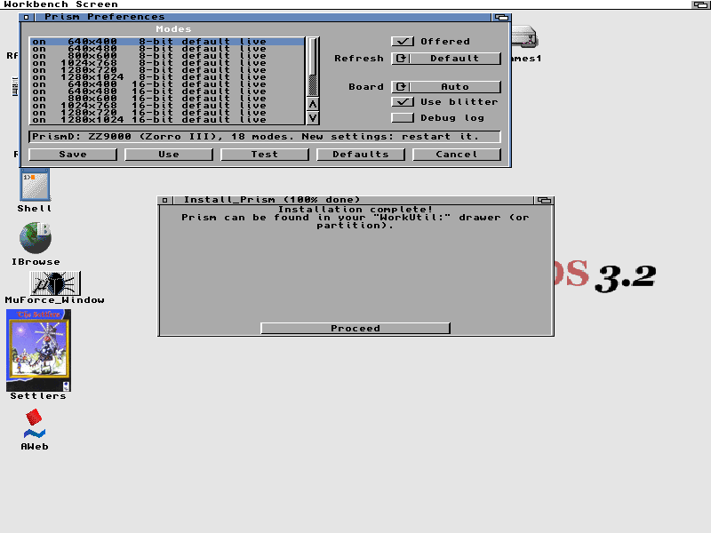
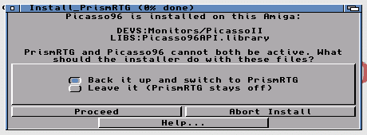

# PrismRTG

Graphics card (RTG) software for AmigaOS 3.x, written from scratch. PrismRTG
puts Workbench and programs on a graphics card in 256 colours, 16-bit and
24/32-bit, drawn by the card's blitter, with a hardware mouse pointer and
its own built-in `cybergraphics.library` and `Picasso96API.library` for programs
that ask for one (both implemented by PrismRTG).

It was written so that its author has an RTG system he can maintain himself:
when something is wrong it can be fixed the same day. Its native drivers
need no Picasso96 or CyberGraphX installation, and it is free software
under the GPL. It takes the place of Picasso96 on the Amiga it runs
on. An optional P96 card-driver adapter can reuse existing `.card` libraries;
the native drivers do not need them.



## Supported cards

| Card | Chip | Tested on | Status |
|---|---|---|---|
| MNT ZZ9000, Zorro III | firmware 2.8 | A4000, 68060 | Real hardware. Blitter fills, copies, text, lines; hardware pointer. 8/16/32-bit up to 1280x1024. |
| GBAPII++ (Picasso II remake) | Cirrus GD5434, 2 MB | A2000, 68030 | Real hardware. Blitter fills, copies, text (8/16/32-bit); hardware pointer. 8/16-bit up to 1024x768, 24-bit 640x480, 32-bit 800x600. |
| Village Tronic Picasso II / II+ | Cirrus GD5426/28 | WinUAE only | Emulation only: never run on a real card. 8/16-bit, 24-bit 640x480. |
| Ateo Concepts Graffity (Zorro II and III) | Cirrus GD5428 | WinUAE only | Emulation only, from WinUAE's description of the board. Same as the Picasso II+. |
| Piccolo SD64, Zorro II | Cirrus GD5434 | WinUAE only | Emulation only. 8/16/24/32-bit, blitter as on the GBAPII++. |
| Piccolo, Zorro II | Cirrus GD5426 | WinUAE only | Emulation only. 8/16-bit, 24-bit 640x480. |
| GVP Spectrum 28/24, Zorro II | Cirrus GD5428 | WinUAE only | Emulation only. 8/16-bit, 24-bit 640x480. |
| MNT ZZ9000, Zorro II mode | | none | Untested. No blitter or pointer support in this mode. |

Needs Kickstart 3.1 or newer (the Workbench disks may be 3.0) and a 68020 or
better. No FPU needed. On Kickstart 3.0 PrismD does not start.

## How small a machine

PrismD, the driver, takes about 330 KB, in fast RAM when there is any and
none of it in chip RAM; since the board drivers became separate modules
(after 1.1 beta 2) it is about 40 KB more, and the buffers that are only
allocated when used (after beta 3) take 35 KB back. Measured in WinUAE on an emulated Picasso II+ (2 MB
on the card), with Workbench 3.2 on a PrismRTG 800x600 16-bit screen and MUI
and a TCP/IP stack loaded, each program started on a freshly booted machine:

| Machine | Free after booting | What ran |
|---|---|---|
| 68030 28 MHz, 2 MB chip + 20 MB fast | 18 MB fast | Everything tried, apart from ScummVM and OpenTTD (want more memory) |
| 68030, 2 MB chip + 4 MB fast | 2.4 MB fast | MysticView, Personal Paint, Directory Opus, IBrowse, AmigaAMP; YAM, AWeb, NetSurf and ADoom found too little memory and said so |
| 68030, 2 MB chip + 2 MB fast | 440 KB fast | MysticView, Directory Opus |
| 68030, 2 MB chip + 1 MB fast | 1.4 MB chip | MysticView, Directory Opus; drawing half as fast (screens that don't fit on the card are kept in chip RAM) |
| 68030, 2 MB chip, no fast RAM | 365 KB chip | Workbench, nothing beside it |
| 68020 or 68EC020 14 MHz, 2 MB chip + 4 MB fast | 2.4 MB fast | The same as the 68030 with 4 MB; drawing about half as fast |

Every PrismRTG test passed on each machine that had room to run it. Short of
memory, programs refused or stopped with a message. The one exception was a
68020 with no fast RAM, where with about 120 KB left a program hung now and
then; nothing pointed at PrismRTG.

Screens that don't fit on the card are kept in RAM, and moving one there
needs RAM for all of it: about 940 KB for 800x600 at 16 bits. With a 2 MB
card, an 800x600 16-bit Workbench and its backdrop picture fill the card, so
a second screen needs about 1 MB free in one piece; an 8-bit Workbench needs
half of that.

### Loadable board drivers

PrismD loads the selected backend from `LIBS:Prism/<name>.driver`, with
`PROGDIR:Drivers` as a fallback for running a build in place. The installer
copies the supplied PICASSO2, ZZ9000, P96 and UAEGFX modules. Keep PrismD
and its modules from the same build; an incompatible module is rejected
with an ABI/version or layout diagnostic.

A driver for another board is one C file built with
`sh tools/mkdriver.sh NAME src/drv_name.c`; `BOARD=NAME` selects it, and
with the board on Auto PrismD tries every other `.driver` in `LIBS:Prism`
after its own. The minimal driver is a mode set and a display start;
`src/drv_template.c` is the starting point,
[docs/writing-a-driver.md](docs/writing-a-driver.md) the guide, with
`PrismTest` to check a driver before PrismD runs on it, and
[docs/driver-development.md](docs/driver-development.md) the full
contract and how to submit a finished driver.

Each loaded module uses its own 16 KB process stack and keeps its callbacks
alive until PrismD stops. The memory measurements above describe the
previous linked build. P96/UAE contexts still stay resident when their card
requires it, while PrismD itself can exit. See
[the module interface and lifetime](docs/driver-modules.md).

### Existing P96 card drivers

The experimental `BOARD=P96` backend loads a P96 `.card` driver directly,
without loading P96's `rtg.library` or monitor program. For example, UAE's
resident driver can be selected with:

```text
Run >RAM:PrismD.log PrismD BOARD=P96 P96CARD=uaegfx.card
```

For boot-time use, set `BOARD=P96` and `P96CARD=uaegfx.card` in
`ENVARC:Prism.prefs` and `ENV:Prism.prefs`. Physical-card drivers normally
use a path such as `LIBS:Picasso96/CyberVision64.card`. Leave any required
chip driver installed as well. The existing P96 monitor programs must
remain disabled, as with native Prism drivers.

See [P96 driver configuration and limits](docs/p96-drivers.md) before
using this backend. It supports linear framebuffers, not every P96 memory
model, and a claimed driver remains resident until reboot. This provides
uaegfx through its P96 driver. A separate native candidate is available below.
Tested so far with UAE's `uaegfx.card` in WinUAE 6.0.3 at 8, 16 and 32 bits
(every PrismRTG test and `p96test`), not yet with a physical card's driver.

### Native UAE RTG candidate

`BOARD=UAEGFX` selects the native candidate, which binds UAE's resident
RTG host interface directly without loading a `.card` file or using the
P96 adapter:

```text
Run >RAM:PrismD.log PrismD BOARD=UAEGFX
```

Enable UAE RTG memory and its hardware cursor. This candidate is selected
explicitly; see [native UAE configuration and limits](docs/uaegfx.md).
Tested in WinUAE 6.0.3 at 8, 16 and 32 bits (every PrismRTG test and
`p96test`).

### In emulators

| Emulator, card | Board in PrismPrefs | Status |
|---|---|---|
| WinUAE, Picasso II / II+, Piccolo, Piccolo SD64, Spectrum (Zorro II and III) | Auto | Tested: every PrismRTG test passes on each; the figures per board are in [docs/emulated-cards.md](docs/emulated-cards.md) |
| WinUAE 6.0.3, UAE RTG Zorro III or Zorro II | UAE (native), or P96 driver with `P96CARD=uaegfx.card` | Tested at 8, 16 and 32 bits: every test passes |
| Amiberry 8.3.0 (Linux), UAE RTG | UAE (native) | With Amiberry's defaults every test passes at 8, 16 and 32 bits. With `rtg_nocustom=false` and ZeroCopy on, 32-bit screens lose some of what is drawn ([amiberry#2392](https://github.com/BlitterStudio/amiberry/issues/2392)) - keep `rtg_nocustom` at its default (true) or turn ZeroCopy off |
| Amiberry inside RetroArch (libretro) | UAE (native) | Not tested. The libretro build has no RTG hardware pointer, so PrismRTG draws its software pointer (tested with WinUAE's hardware sprite turned off) |
| FS-UAE 3.1.66 (Linux), UAE RTG | UAE (native), or P96 driver with `P96CARD=uaegfx.card` | Tested at 8, 16 and 32 bits: every test passes, both ways. FS-UAE 3.1 cannot open files that are read-only on the host, so a system folder shared from Windows with read-only files will not boot until the attribute is cleared |
| MiSTer (FPGA), ZZ9000 core | Auto (ZZ9000) | Reported working with no pointer and garbled text in the Shell (issue #2); `SOFTWAREPOINTER=ON` in `ENV:Prism.prefs` should give a pointer (not tested on a MiSTer yet) |

UAE's RTG card needs its hardware pointer ("Hardware sprite emulation" in the
RTG settings): PrismRTG draws no pointer of its own. WinUAE has it on by
default; Amiberry from the version after 8.3.0 too, and in 8.3.0 it has to be
switched on.

## What works

* PrismRTG modes appear in Prefs/ScreenMode and ASL requesters (`PRISM:800x600 16bit` ...).
* Workbench 3.2 on the card at 8, 16, 24 and 32 bits, with colour icons.
  Both the OS's own `icon.library` and PeterK's `icon.library` 51.4 are
  used daily: the two real machines run PeterK's (which keeps its work
  bitmaps in fast RAM - PrismRTG draws into those itself), the emulated
  test machines the OS's.
* graphics.library drawing into PrismRTG screens, checked pixel-for-pixel
  against the native chipset (`PrismBench`: fills, lines, text, planar blits).
* cybergraphics.library 41 API: MultiView, AWeb and Amelinium show
  true-colour pictures.
* Picasso96API.library 2 (PrismRTG's own): bitmaps in any pixel format, mode
  lists and requester, screens, pixel arrays in every direct-colour format,
  board data. `p96test` checks every call at 8, 16 and 24 bits. No
  picture-in-picture windows.
* Screens that don't fit in video memory page out to fast RAM; double
  buffering through `AllocScreenBuffer` / `ChangeScreenBuffer`.
* `Prefs/PrismPrefs`: which modes are offered, refresh rates, board,
  blitter on/off, red and blue swapped in 256-colour palettes, the debug
  log (off, on, or written at once for a machine that dies while starting),
  and a **Test** button that shows a mode for ten seconds and comes back by
  itself.
* Boot failsafe: hold the left mouse button while booting and PrismRTG does
  not start; a start that hangs is skipped automatically on the next boot.

Neither card lets software read what the monitor supports (the ZZ9000
firmware has no DDC code; the GBAPII++ does not wire the chip's DDC data
pin), so there is no automatic monitor detection: use the Test button.

## Speed against Picasso96

Same machine, same card, same benchmark (`PrismBench`), operations per
second, higher is better. Picasso96 is the current release from Individual
Computers (rtg.library 43.760 of 18 December 2025) with each card's own
driver. Run-to-run noise is about 5%.

These are a handful of drawing operations on two cards, and they say nothing
about everything else Picasso96 does and PrismRTG does not: a long list of
cards, picture-in-picture, years of tested compatibility. Picasso96 may well
make different trade-offs for good reasons. `PrismBench` is included, so
anyone can repeat the measurements on their own machine.

### A4000, 68060, ZZ9000 - 800x600, 8-bit

PrismRTG 1.0 as released (5 October 2026); Picasso96 measured on the same
machine two days earlier.

| Test | Picasso96 | PrismRTG 1.0 |
|---|---|---|
| RectFill 100x100 | 19,933 | **22,046** |
| RectFill 8x8 | 26,148 | **35,484** |
| Text, 40 characters | 4,894 | **5,387** |
| Text, 4 characters | 9,844 | **15,433** |
| ClipBlit 200x100 | 5,493 | **8,695** |
| ScrollRaster 400x100 | 5,520 | **11,149** |
| Line, ~390 pixels | 18,134 | **26,761** |
| WritePixel | 92,941 | **117,717** |
| Planar blit 64x32 (icons) | 241 | **1,007** |
| Bitmap-to-screen blit 64x32 | 11,178 | **24,271** |

16-bit and 32-bit show the same pattern (WritePixel at 32-bit: 92,875 /
99,498). Screen flips (`ScreenToFront` between two PrismRTG screens) run at
25-33 a second against 50 for two native screens: one extra frame per flip.

### A2000, 68030 at 50 MHz, GBAPII++ - 640x480

Measured on 4 October 2026 with the build of that day (the A2000 has not run
the released build yet).

| Test | P96 8-bit | **PrismRTG 8** | P96 16-bit | **PrismRTG 16** |
|---|---|---|---|---|
| RectFill 100x100 | 3,902 | **3,987** | 2,865 | 2,807 |
| RectFill 8x8 | 5,094 | **6,765** | 4,918 | **6,475** |
| Text, 40 characters | 1,343 | **1,516** | 1,280 | **1,478** |
| Text, 4 characters | 2,678 | **3,665** | 2,619 | **3,470** |
| ClipBlit 200x100 | 1,107 | **1,408** | 652 | **730** |
| ScrollRaster 400x100 | 698 | **819** | 383 | **409** |
| Line, ~390 pixels | 1,805 | **2,007** | 1,488 | **1,945** |
| WritePixel | 14,646 | **23,480** | 14,206 | **22,773** |
| Planar blit 64x32 (icons) | 306 | **361** | 160 | **173** |
| Bitmap-to-screen blit 64x32 | 2,378 | **4,125** | 2,025 | **3,249** |

True colour on the GBAPII++ comes in two formats, and they trade off:

| Test | P96 "24" | PrismRTG 24-bit | PrismRTG 32-bit |
|---|---|---|---|
| RectFill 100x100 | 1,001 | 786 | **1,485** |
| Text, 40 characters (JAM1) | 416 | 279 | **1,307** |
| Text, 40 characters (JAM2) | 214 | 201 | **1,296** |
| ClipBlit 200x100 | 406 | **430** | 304 |
| ScrollRaster 400x100 | 213 | 188 | 162 |
| WritePixel | 13,718 | **19,158** | **18,730** |
| Planar blit 64x32 (icons) | 108 | 103 | **120** |

The chip's blitter can fill and draw text at 32 bits but not at 24, and it
copies about the same number of bytes per second in either format. So
32-bit is much faster for text and fills, and 24-bit is about a quarter
faster for copies and scrolling because each pixel is smaller. Both are
offered; choose in Prefs/ScreenMode. Picasso96 was measured in its 24-bit
mode only.

## Software it has been seen running

Started one after another on an emulated Picasso II+ with Workbench on a
PrismRTG screen at 16-bit and again at 256 colours, each screen captured
and looked at (`docs/design.md` has the full list and what was found):
AWeb, IBrowse, NetSurf, Amelinium, AmIRC, YAM, SimpleMail, WookieChat,
Directory Opus 4, MultiView, MysticView, Personal Paint 7, ArtEffect 4,
AmigaAMP, AMPlifier, HippoPlayer, Eagleplayer, FileX, EvenMore, CharMap,
Lupe, HomeBank, MUIbase, MakeCD, FryingPan, Amiga Chess RTG, AmiArcadia,
ArTKanoid, WBsteroids, MagicNumbers, dynAMIte, iGame, Ballfield, ADoom,
DoomAttack, AHeretic, Hexen, the Joyride demo, Visage, CyberAVI, P96Speed.
On the real A4000: CgxBenchmark, OpenDUNE, the KillerCGX demo, Amelinium.

## Install

Unpack the archive, open the `PrismRTG` drawer and double-click
**Install_PrismRTG** (the standard Amiga Installer). It

* finds the card,
* looks for an installed Picasso96 - its monitor files in `DEVS:Monitors`
  and its `Picasso96API.library` - lists what it found and asks:
  **back it up** (the files are moved to `SYS:Storage/Picasso96-parked`
  with a note of where each came from) or **leave it** (nothing is
  touched, and PrismRTG stays off). Nothing of Picasso96 is ever deleted,
* asks which PrismRTG screen Workbench should open on.



Reboot. Run Install_PrismRTG again to update or to remove PrismRTG; Remove
moves Picasso96 back out of the backup drawer and puts the previous screen
mode back.

PrismRTG and Picasso96 cannot both be active on one Amiga: with Picasso96's
monitor files still in `DEVS:Monitors` (or its `rtg.library` in memory),
PrismD prints why and does not start. The product is called PrismRTG; its
files keep their short names (`PrismD`, `PrismPrefs`, the monitor file
`Prism`, the `PRISM:` screen modes).

| Installed file | What it is |
|---|---|
| `C:PrismD` | the driver, started at boot |
| `LIBS:Prism/*.driver` | separately loaded board backends |
| `DEVS:Monitors/Prism` | starts PrismD before Workbench opens |
| `SYS:Prefs/PrismPrefs` | settings editor |
| `C:PrismSetup`, `C:PrismProbe` | installer helper, board lister |
| `ENVARC:Prism.prefs` | the settings (plain text) |

If the screen stays dark: hold the left mouse button during boot, then use
PrismPrefs to switch a mode off, change its refresh rate or turn the
blitter off.

## Known limits

* Tested on two machines by one person. Treat it as early software.
* **Software pointer:** boards without a working hardware pointer get one
  drawn into the screen; `SOFTWAREPOINTER=ON` in `ENV:Prism.prefs` forces it.
  It costs a few percent of drawing speed (WritePixel about 14%), and while a
  program draws over the pointer itself it is taken away and comes back a
  moment later.
* **Off unless switched on:** screen dragging (`DRAGGING=ON`) and
  Picasso96 PIP windows go through a compositor that redoes only what
  changed and copies the dragged screen with the card's blitter; a program
  drawing on a dragged screen keeps most of its speed on a 68030. Off,
  they cost nothing. Few programs have used it yet.
* Vertical dragging composes the front and next RTG screen; native-chipset
  screens cannot be mixed into the split. No monitor detection (see above).
* The Picasso II, Piccolo, Piccolo SD64, Spectrum and Graffity have only run in WinUAE.
  A real card can differ from its emulation (the GBAPII++ did, in three
  places). If 256-colour screens on a real Piccolo or Spectrum show red and
  blue exchanged, tick **Swap red/blue** in PrismPrefs.
* The installer's Remove path has been run in the emulator, not yet on a
  real machine.
* On the A2000 one unexplained crash was seen shortly after a cold boot;
  the boot failsafe recovered it and it has not been reproduced.

## Reporting a problem

Download **PrismCheck** from the release page and run it on the Amiga (double-click it
with PrismRTG running). In 2 to 5 minutes it records the system, the card,
PrismRTG's settings and modes, and runs every drawing test, the Picasso96 API test
and `vramcheck` - into one text file. Attach that file to an
[issue](https://github.com/lainejones/PrismRTG/issues) with a few words on what
you saw on the screen.

## Build

Needs amiga-gcc (Bebbo) under WSL or Linux:

```sh
./build.sh
```

Output goes to `out/`, the release drawer to `out/pkg/PrismRTG`.
`./build.sh` packages last, after every program is built. The icons are
finished `.info` files in `dist/`.

| Tool | What it does |
|---|---|
| `PrismD` | The driver. `PrismD [BOARD=ZZ9000|PICASSO2|P96|UAEGFX|<name>] [P96CARD=file] [P96MONITOR=icon] [PREFS=file] [LOG]`; Ctrl-C removes its patches when no PrismRTG screen is open and no program holds a PrismRTG bitmap. P96 and UAEGFX contexts remain resident until reboot. |
| `PrismPrefs` | Settings editor. `FROM= USE SAVE TEST=<slot>` work without the window. |
| `Prism` (`out/PrismMon`) | `DEVS:Monitors` launcher with the boot failsafe. |
| `PrismSetup` | Installer helper: `DETECT`, `WBMODE=<slot>`. |
| `PrismProbe` | Lists expansion boards and marks the ones PrismRTG can drive. Read-only. |
| `PrismBench` | Benchmark and pixel-exactness checks: `MODEID=$7A00xxxx`, `LIST`. |
| `PrismTest` | A driver on its own, without PrismD: loads `BOARD=NAME` (any `.driver`), sets a mode, draws a pattern, checks the driver's fills and copies against the CPU (`BLIT`). |
| `PrismScreen`, `PrismShow`, `PrismMouse`, `prismdiag` | Test clients: screens, pictures, pointer, display database dump. |
| `ddcprobe`, `zztime`, `iotime`, `memwhere`, `p2peek` | Hardware probes and timing tools. |

[docs/design.md](docs/design.md) has the architecture, how each part was
built, and every measurement; [docs/zz9000-hw.md](docs/zz9000-hw.md) and
[docs/cirrus-picasso2-hw.md](docs/cirrus-picasso2-hw.md) are the hardware
notes the drivers were written from.

## Credits

PrismRTG is written by Laine Jones, with Claude (Anthropic) as co-author -
noted in every commit. With thanks to:

* **Stefan Reinauer** - the build fixes (#3), the P96 card-driver adapter
  (#4), the native UAE RTG driver (#5), the format-aware surface operations
  (#6), the loadable board-driver modules (#8), the P96 memory pools,
  shadow transfers and UAE planar probe (#9) and the software pointer,
  screen dragging and PIP composition (#10).
* **Dimitris Panokostas** (midwan, author of Amiberry) - reviewed the UAE
  driver and found its `SetPanning` / `BitMapExtra` bug (#5), and made
  Amiberry's RTG hardware pointer the default so PrismRTG shows a pointer
  there ([amiberry#2388](https://github.com/BlitterStudio/amiberry/pull/2388)).
* **polluks** and **yelworC** - the first test on a MiSTer FPGA (#2).
* **Individual Computers**, **Alexander Kneer**, **Tobias Abt** and **Thomas
  Richter** - the P96 driver development headers in `src/p96sdk` (CC-BY),
  which the P96 card-driver adapter is built with.
* **Toni Wilen** - WinUAE, in which every Cirrus board here was tested,
  and whose source is the only public description of the Graffity.

### Where the hardware knowledge came from

PrismRTG's drivers are its own code, written from hardware facts: register
numbers, bit meanings and command sequences. No board's data book was
available, so those facts were read from these public sources (licences in
brackets; the exact files and revisions are listed in
[docs/cirrus-picasso2-hw.md](docs/cirrus-picasso2-hw.md) §10 and
[docs/zz9000-hw.md](docs/zz9000-hw.md)):

* **MNT Research / Lukas F. Hartmann** - the ZZ9000 card driver and
  firmware (GPL-3.0-or-later), for the ZZ9000's registers and mailbox.
* **NetBSD** `grf_cl` (BSD), **Linux** `cirrusfb` (GPL-2.0),
  **xf86-video-cirrus** (MIT), **QEMU** `cirrus_vga` (MIT), **86Box** and
  **PCem** via WinUAE (GPL-2.0) - the Cirrus GD542x/543x registers and
  blitter.
* **Matthias Heinrichs** - the GBAPII++ / A500-GraKa design files, for
  that board's bus and monitor switch.
* **Individual Computers** - the P96 driver development headers (above),
  which also define the Picasso96 API numbers PrismRTG's own
  `Picasso96API.library` implements.

Programs talk to PrismRTG through the cybergraphics and Picasso96
interfaces: their function and tag numbers are reproduced so that existing
programs work; the implementations behind them are PrismRTG's own.

Contributions are welcome; everyone whose code or findings go into PrismRTG
is named here and in the release notes.

## Licence

GNU General Public License, version 3 (GPL-3.0-only). Copyright (c) 2026 Laine Jones and Stefan Reinauer; each source file names its authors.
See [LICENSE](LICENSE) and [CONTRIBUTING.md](CONTRIBUTING.md).
